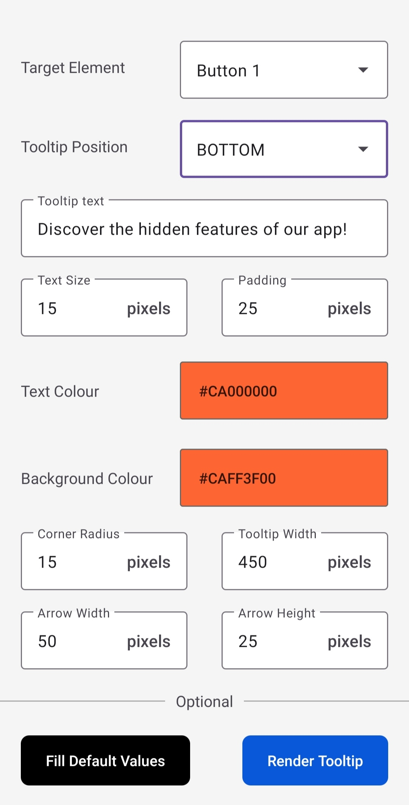
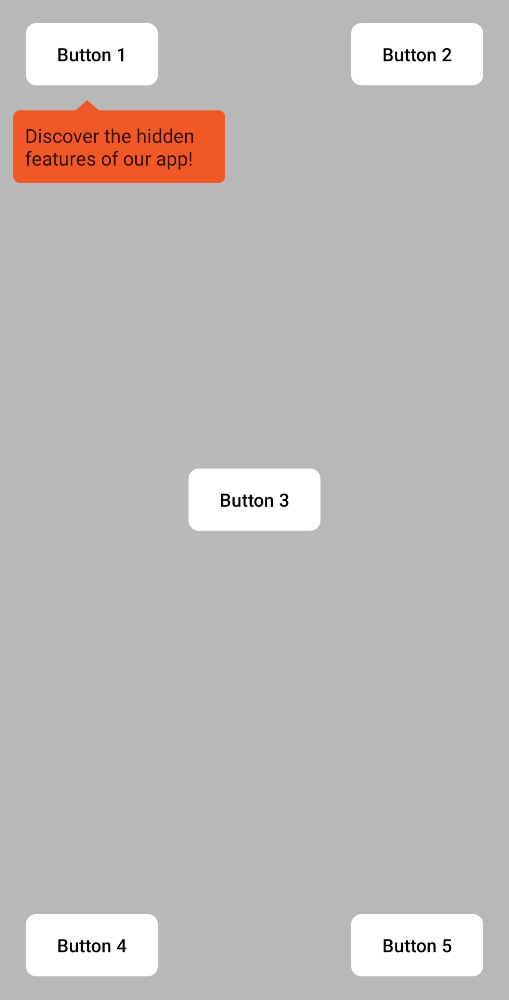
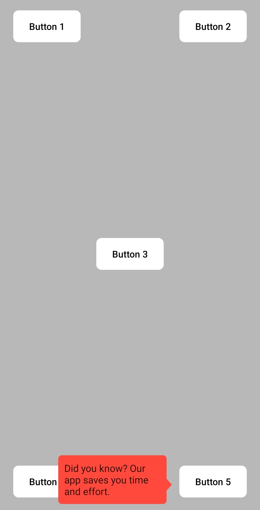
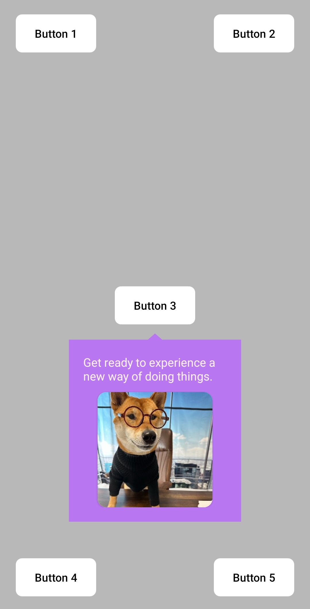

# Dynamic Tooltip 📱
A mobile application that allows you to create dynamic tooltips with customizable positioning, style, and text for any target element.

## Features 🌟

- <b>Target Element Selection:</b> Choose any element on the screen as the target for the tooltip. 👆
- <b>Positioning:</b> Position the tooltip above, below, to the left, or to the right of the target element. ⬆️⬇️⬅️➡️
- <b>Arrow Alignment:</b> The tooltip arrow is intelligently positioned to always point to the center of the target element, enhancing visual clarity and intuitiveness. 🔍
- <b>Customizable Style:</b> Adjust the tooltip's width, border radius, arrow width, arrow height, padding, text color, and background color to match your desired look and feel. 🎨
- <b>Text Content:</b> Set the text content of the tooltip to provide useful information or instructions. 📝
- <b>Image Support:</b> Optionally include an image inside the tooltip, with customizable image radius, width, and height. 🖼️
- <b>Dynamic Positioning:</b> The tooltip calculates whether it can fit on the screen with the given parameters before rendering, ensuring it does not exceed the screen boundaries. 📏
- <b>Seamless Integration:</b> The tooltip seamlessly works with buttons at any location on the mobile screen preview. 🔄
- <b>Fill Default Values:</b> Quickly populate the tooltip parameters with default values for a hassle-free setup. 🚀

## How It Works 🧠
The tooltip app incorporates background calculations to determine whether the tooltip can fit on the screen with the specified parameters. It takes into account the target element, positioning, style, and text content to dynamically calculate the tooltip's dimensions and position.

By performing these calculations, the app ensures that the tooltip does not exceed the screen boundaries and provides an optimal user experience. Only when it's possible to fit the tooltip within the available screen space, it is rendered on the screen for the user to see and interact with.

## Screenshots 📷

  

## Video Preview 📹

## Contributing 🤝
Feel free to contribute to this project by submitting issues, pull requests, or providing valuable feedback. Your contributions are always welcome! 🙌

## License 📄
Dynamic Tooltip is released under the [MIT License](https://opensource.org/licenses/MIT). Feel free to modify or add to this list based on the specific features of your app. 📝

## Happy coding! 🎉👩‍💻👨‍💻
